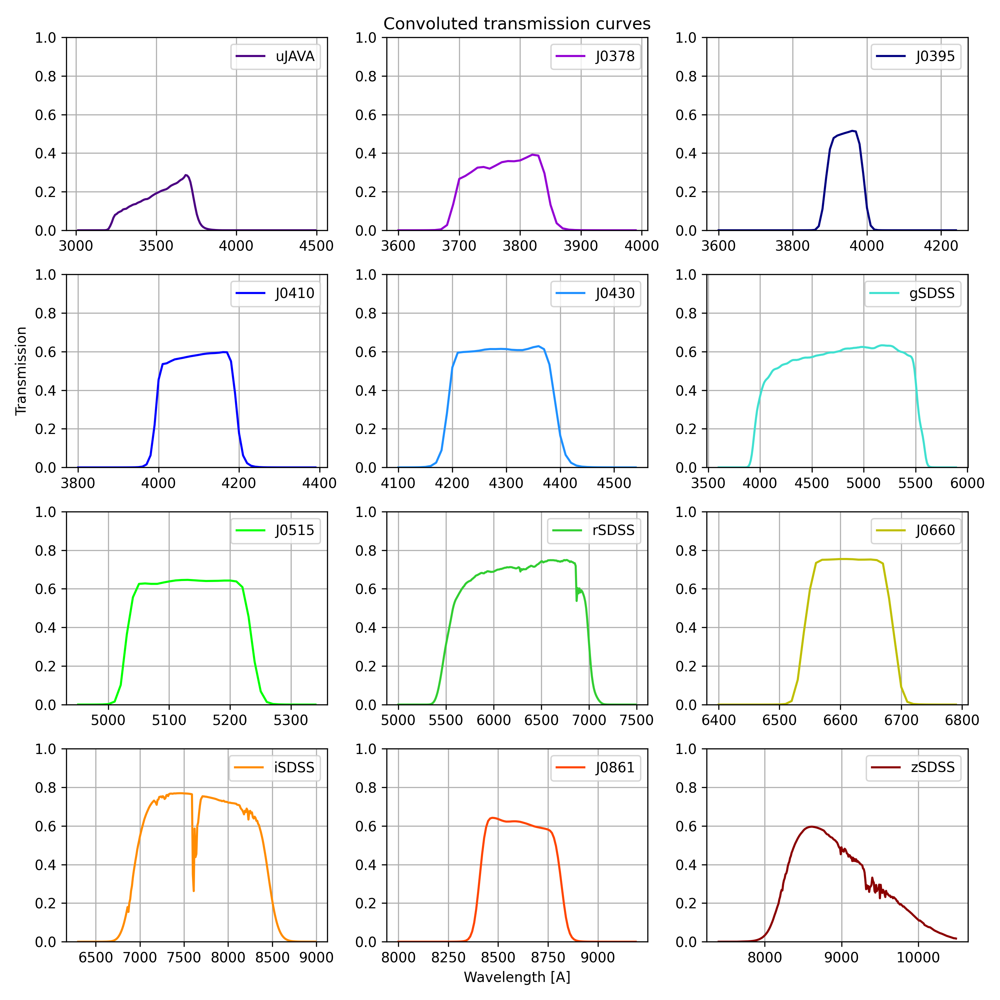
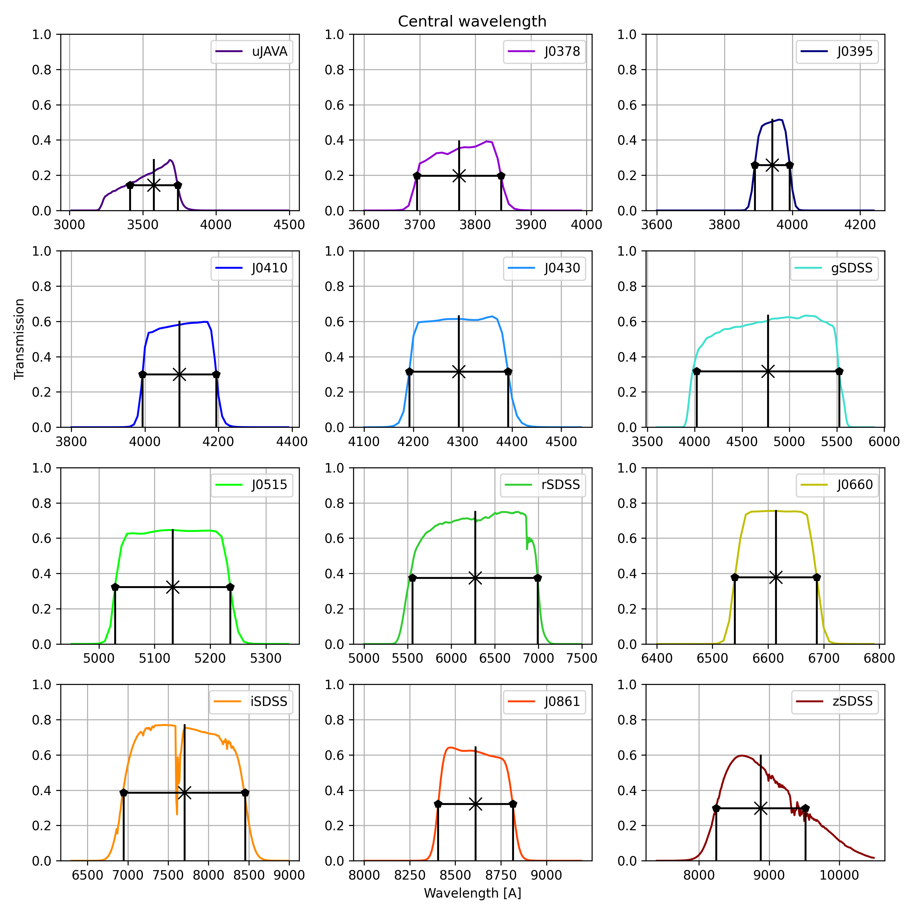
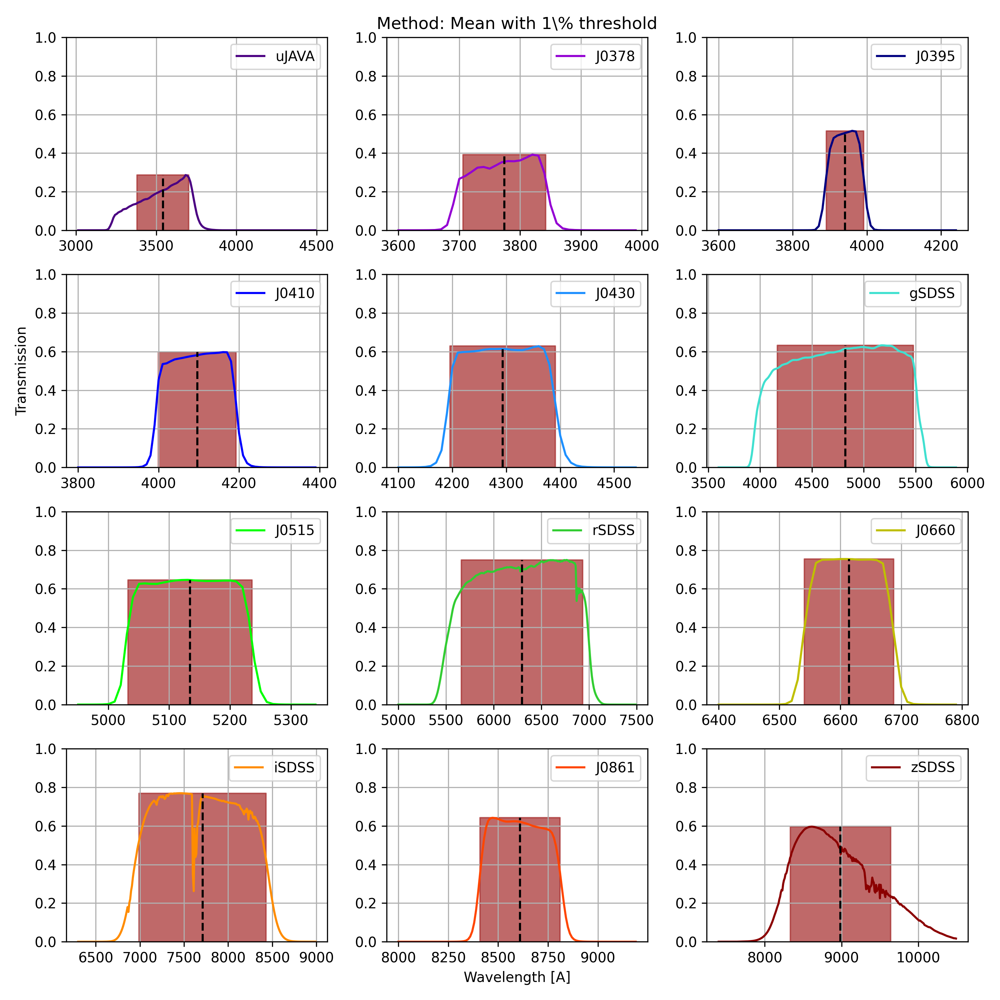
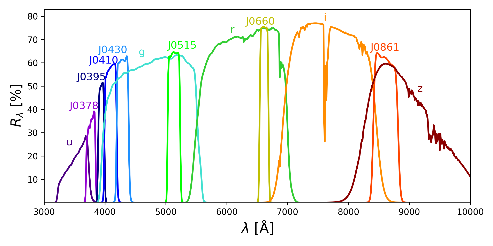

```markdown
# S-PLUS Filters Transmission Curve Calculator


## Overview

This Python script calculates the transmission curves for S-PLUS filters and estimates the central wavelength using different methods along with the Full Width at Half Maximum (FWHM) and the Equivalent Width (or at least a variation of that). It offers various options to generate different types of output products.

- Calculate transmission curves both from the lab and convoluted with the atmophere and instrument
- Estimate central wavelengths
- Generate a CSV file containing the values for central wavelengths and widths
- Create an HTML for the same table as in the CSV

## Features

- Calculate the transmission curve for a given filter.
- Estimate the central wavelength and the width through different methods.
- Save plots of the filter.
- Save transmission curves in CSV format.
- Save central wavelengths in a CSV file (use with `--save_central_wavelentghs`).
- Display individual lab filters (use with `--show_individual_filters`).
- Show main plots (use with `--show_plots`).
- Save main plots (use with `--save_plots`).
- Configure logging level and activate debug mode.
- For help, use `-h`.

## Usage

To run the script, use the following command:

```bash
python3 splus_filter_calculator.py [OPTIONS]
```

### Options

- `--work_dir [WORK_DIR]`: Specify the working directory. (Default: Current working directory)

- `--save_plots`: Save several plots with the filtes.

- `--save_central_wavelengths`: Save the central wavelengths of the filters in a CSV file.

- `--show_individual_filters`: Show the individual filters. (Only activate when `--save_csv_filters` is used)

- `--show_plots`: Show the main plots.

- `--loglevel [LOGLEVEL]`: Set the log level. (Default: INFO)

- `--debug`: Activate debug mode.

## Output Products
- When `--save_plots` is used, save the following plots:








Final curves of the S-PLUS filters.


- When `--save_csv_filters` is used, the script generates CSV files containing the convolved transmission curves of the filters.

- When `--save_central_wavelengths` is used, the script generates a CSV file containing central wavelengths calculated using four different methods.

- The script also creates an HTML report that can be loaded in a web browser. This HTML file contains a table with the same data as the central wavelengths CSV file.

## License

This code is licensed under the [GNU v3.0 License](LICENSE).

## Author

[Herpich F. R.](https://orcid.org/0000-0001-7907-7884)

## Acknowledgments

T80S Technical Team
```
