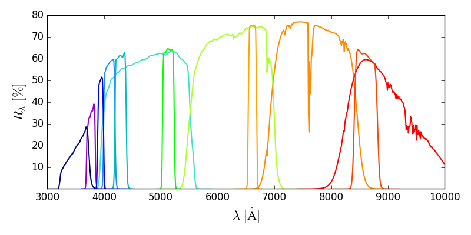

T80S telescope filter transmission curves
-------------------------------------------

About
+++++

The transmission curves are obtained after convolving the original measures taken by the company that produced the filters with the sky trasmission curve for Paranal (provide by ESO sky tramission tool), the mirror reflectance, and the CCD efficiency. The S-PLUS 12 filters trasmitance are shown by the figure below.

The effective central wavelenghts as well as the  are obtained by calculating the FWHM of each filter. 

TBD
